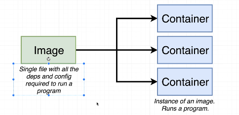
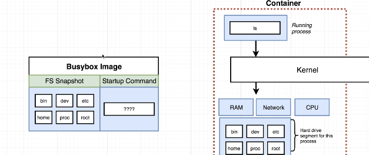
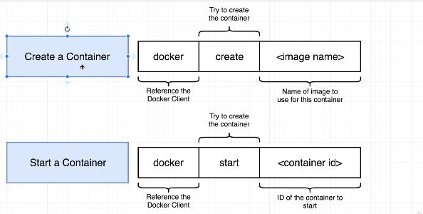
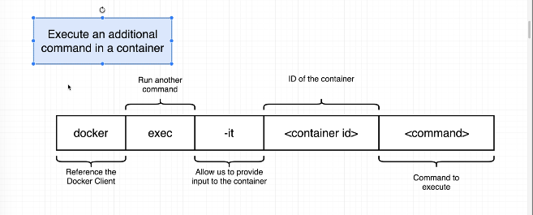
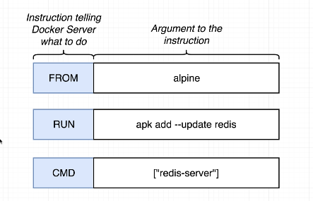

# WHY USE Docker?  

- Docker makes it really easy to install and run software without worrying about setup or dependencies

## What is Docker?  

- Docker is a platform or ecosystem around creating and running containers  

## container and Image  

the above can be refered to what process are running  with it

## Docker for windows /mac

  

## Steps for installing Docker on a mac  

## Docker understanding  

  

## System work Flow  

  

## creating and runing containers

## Image structure

## creating and starting a container

## Running additional command in a container

## The It Flag

## creating our own image

- dockerfile
- docker client is the terminal
- docker server it going the take over and do the heavy lifting for us
- build a useable image that would be use to start a container

## docker flow

## docker instruction on file

## adding and id to docker build

## Docker port forwarding and reciving

