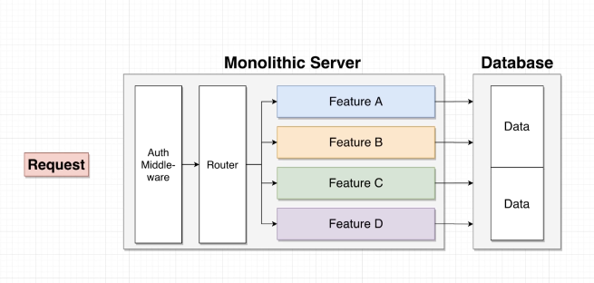
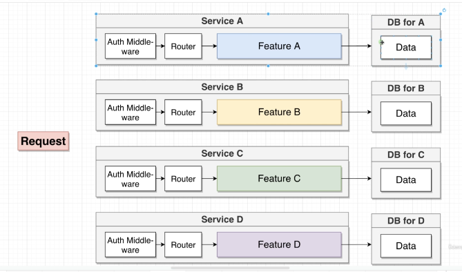
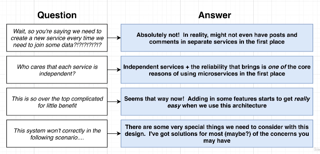
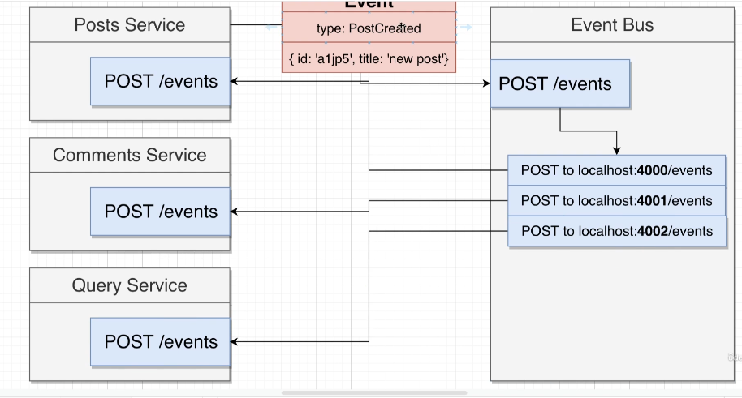

# What is a micro Service  

***first let understand how we were building thinks***  

summarize monolith contains  
  

sumarize of a single micro service  
  

## MIcroservice proper  

if any potion of feature not working they service still works  

## PROBLEM OF MICROSERVICES 1  

- Data Management between service: this is the big problem of microservice  
- How we store data: every feature as a db and secondly Services will never , ever reach into another service database
reason for above is :
  - db scaling ..  and db downtime.  
  - Db Schema/structure might change unexpectedly
  - some service might function more efficiently with different
  - types of db (sql vs nosql)

How communications are done betwwen 2 service:

- sync: Services communicate with each other using direct requests
  - Async: Services communicate with each other using events
  - types:
  - event bus
  - event emmitting: simultinouesly  

## EVENT BUS  

  

## work flow  

